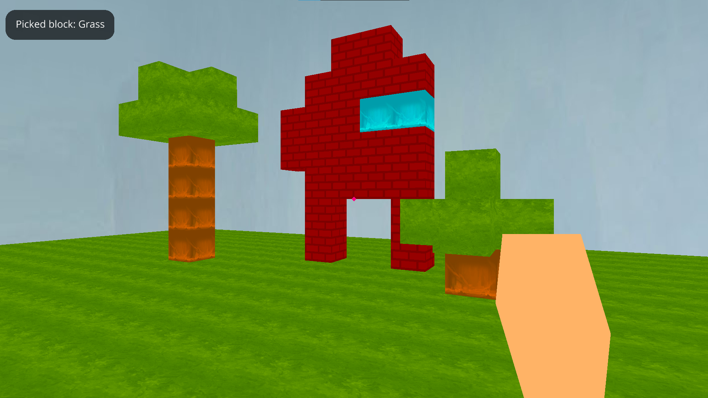
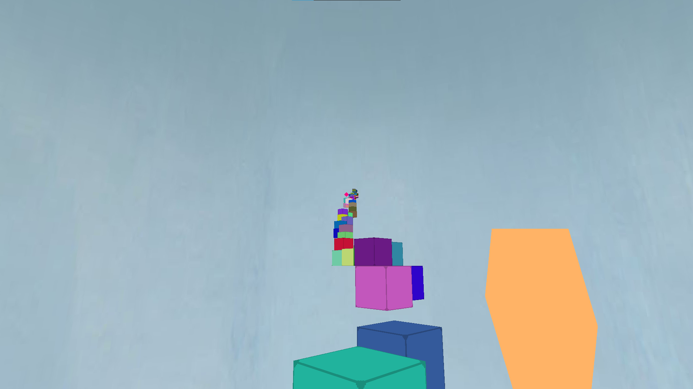
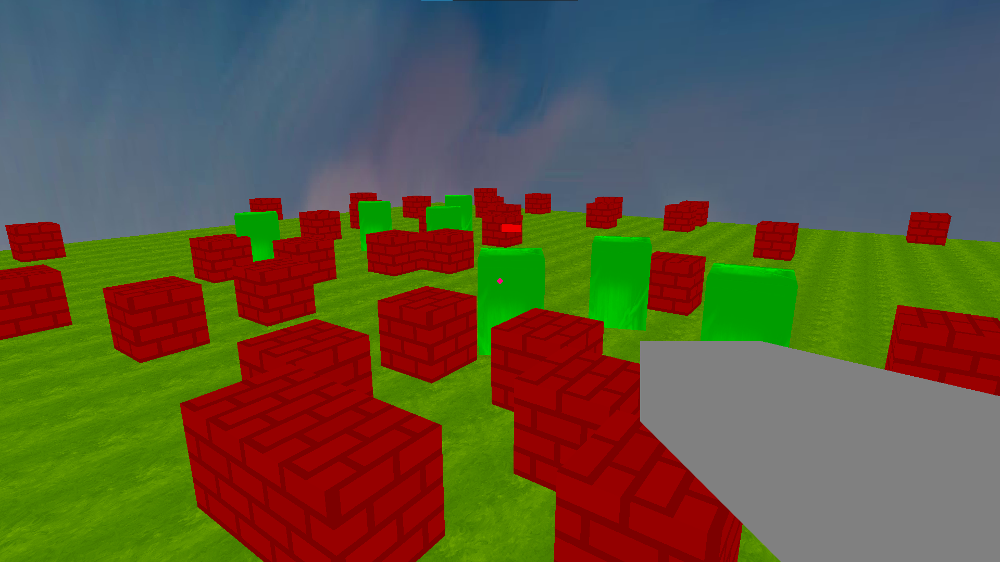

# Orangecraft
A simple Minecraft clone in Python made with ursina engine. It has 3 maps (in different Python files): Sandbox, Parkour and Zombie Shooter. 

## Dependencies
<li><a href="https://www.ursinaengine.org/installation.html">ursina engine</a></li>

## Sandbox
Press LMB to break blocks, RMB to place. Use 1-4 number keys to pick different blocks (1-grass, 2-wood, 3-water, 4-brick). 
Fun fact: wood and water blocks have the "sky_default" texture, same as the sky.  

## Parkour
Just parkour until you reach the big block with noise texture. 
Fun fact: the blocks are generated randomly.  

## Zombie Shooter
Press LMB to shoot. Kill all zombies. 
You don’t take damage, and zombies will stop following you if you jump or stand on a brick block. 
Fun fact: there’s a shooting sound.  

