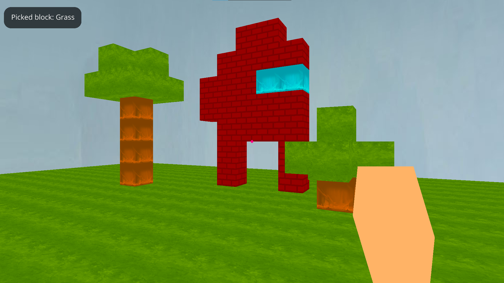
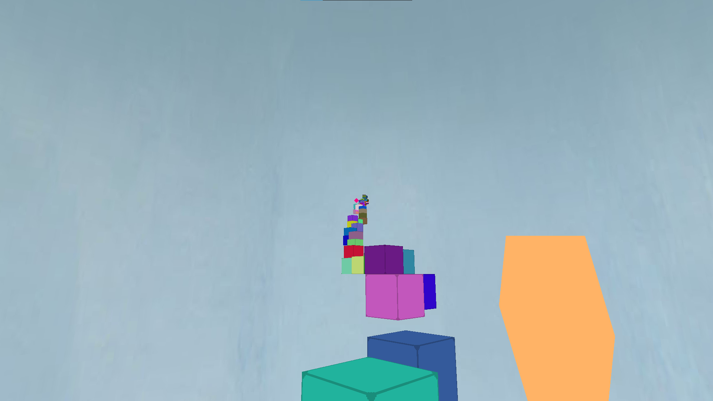
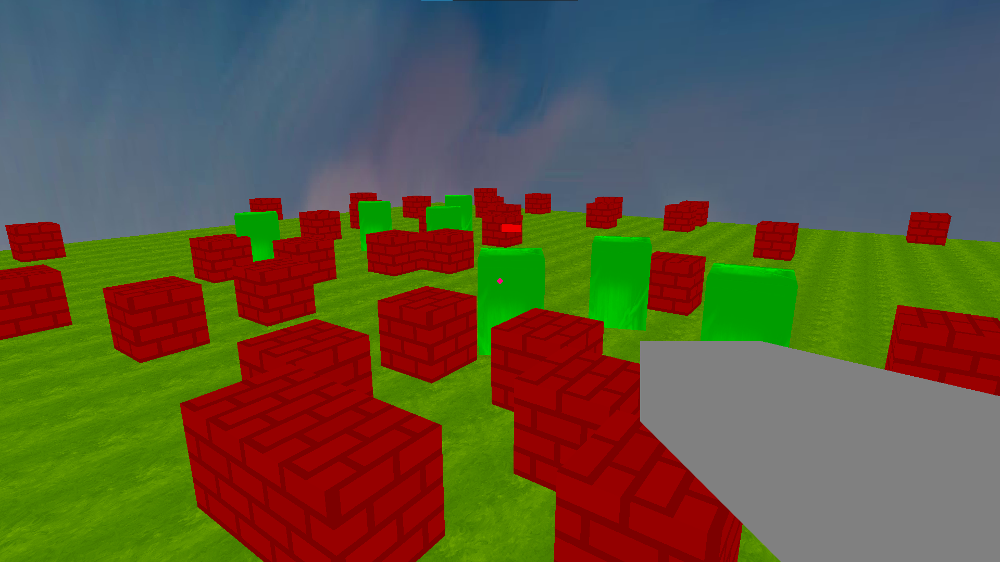

# Ursinacraft
Simple Minecraft clone in Python (ursina engine) with 3 maps: Sandbox, Parkour and Zombie Shooter. 

## Requirements
<li><a href="https://www.ursinaengine.org/installation.html">ursina</a></li>

## Controls

### General
W, A, S, D - move. 
Spacebar - jump. 
Mouse - look around. 
Escape - quit. 

### Sandbox
Left mouse button - break blocks. 
Right mouse button - place blocks. 
1...4 - change picked block (1=grass, 2=wood, 3=water, 4=brick).

### Parkour
No special controls.

### Zombie shooter
Left mouse button - shoot. 
Note: you don't take damage from zombies, and they don't follow you while you're in air or standing on a brick block.

## Screenshots

### Sandbox

### Parkour

### Zombie Shooter

